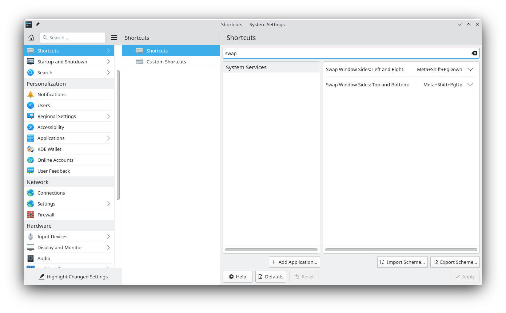

# Swap Halves

Extension for KDE’s window manager to add keyboard shortcuts to swap the windows tiled to the left and right or top and bottom halves of the screen.





## Installation

### Dependencies

`kwin`.

### Installation via graphical interface

1. Install the script via *System Settings* > *Window Management* > *KWin Scripts* > *Get New Scripts …* > search for *Swap halves* > *Install*.
2. Enable the script by activating its checkbox, and apply the settings.

### Installation via command line

```bash
git clone https://github.com/nclarius/KWin-window-geometry-scripts.git
cd KWin-window-geometry-scripts/swap-halves
./install.sh
```


## Configuration

To set the shortcuts to trigger the action, go to *System Settings* > *Shortcuts* > search for *Swap Window Sides* > set your preferred shortcuts.


## Small Print

© 2021-2022 Natalie Clarius \<natalie_clarius@yahoo.de\>

This work is licensed under the GNU General Public License v3.0.  
This program comes with absolutely no warranty.  
This is free software, and you are welcome to redistribute and/or modify it under certain conditions.  

If you would like to thank me, you can always make me happy with a review or a cup of coffee:  
<a href="https://store.kde.org/p/1617645"></a>
<a href="https://www.paypal.com/donate/?hosted_button_id=7LUUJD83BWRM4"></a>&nbsp;&nbsp;<a href="https://www.buymeacoffee.com/nclarius"></a>
